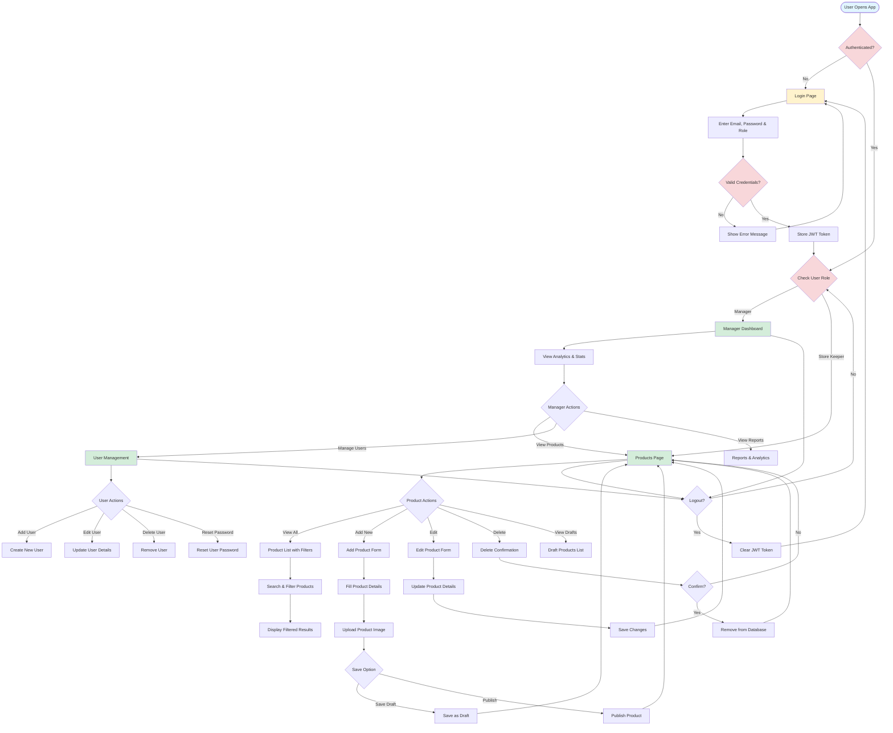

# Product Management System

A comprehensive full-stack product management system built with Next.js and Node.js, featuring role-based access control, real-time inventory tracking, and an intuitive dashboard interface.


## 🚀 Features

### Core Functionality
- **Role-Based Authentication**: Secure JWT-based authentication with Manager and Store Keeper roles
- **Product Management**: Complete CRUD operations for products with image upload support
- **Real-time Dashboard**: Interactive analytics dashboard with charts and statistics (Manager only)
- **Inventory Tracking**: Monitor stock levels with low-stock alerts
- **Draft System**: Save products as drafts before publishing
- **Search & Filter**: Advanced product search and category filtering
- **Responsive Design**: Modern, mobile-friendly UI with Tailwind CSS

### User Roles
- **Manager**: Full access to dashboard, analytics, user management, and product operations
- **Store Keeper**: Access to product management and inventory operations

## 🛠️ Tech Stack

### Frontend
- **Framework**: Next.js 16.1.3 (React 19.2.3)
- **Styling**: Tailwind CSS 4
- **UI Components**: Custom components with Heroicons & Lucide React
- **Charts**: Recharts for data visualization
- **State Management**: React Context API
- **Language**: TypeScript

### Backend
- **Runtime**: Node.js
- **Framework**: Express.js
- **Database**: MongoDB with Mongoose ODM
- **Authentication**: JWT (JSON Web Tokens)
- **File Upload**: Multer
- **Security**: Helmet, CORS, express-rate-limit
- **Validation**: express-validator
- **Password Hashing**: bcryptjs

## 📊 Application Flow



## 🎯 User Journey

### Manager Flow
1. **Login** → Enter credentials with Manager role
2. **Dashboard** → View analytics, statistics, and charts
3. **Product Management** → Add, edit, delete products
4. **User Management** → Manage store keepers and other users
5. **Reports** → View inventory reports and low-stock alerts

### Store Keeper Flow
1. **Login** → Enter credentials with Store Keeper role
2. **Products Page** → Direct access to product inventory
3. **Product Operations** → Add, edit, delete products
4. **Draft Management** → Save and manage product drafts
5. **Inventory Tracking** → Monitor stock levels

## 📁 Project Structure

### Frontend Structure
```
slooze-frontend/
├── app/                      # Next.js App Router
│   ├── page.tsx             # Root page with role-based routing
│   ├── layout.tsx           # Root layout with AuthProvider
│   ├── globals.css          # Global styles
│   ├── login/               # Login page
│   ├── register/            # Registration page
│   ├── dashboard/           # Manager dashboard
│   ├── products/            # Products listing page
│   └── add-product/         # Add/Edit product page
├── components/              # Reusable components
│   ├── Header.tsx          # App header with navigation
│   ├── Sidebar.tsx         # Navigation sidebar
│   ├── Navbar.tsx          # Top navigation bar
│   └── ProtectedRoute.tsx  # Route protection HOC
├── context/                # React Context
│   └── AuthContext.tsx     # Authentication context
├── utils/                  # Utility functions
├── public/                 # Static assets
└── package.json
```

### Backend Structure
```
slooze-backend/
├── models/                 # Mongoose models
│   ├── User.js            # User model
│   └── Product.js         # Product model
├── routes/                # API routes
│   ├── auth.js           # Authentication routes
│   ├── products.js       # Product routes
│   └── users.js          # User management routes
├── middleware/            # Custom middleware
│   └── auth.js           # JWT authentication middleware
├── uploads/              # Product images storage
├── server.js             # Main server file
├── seed.js               # Database seeding script
└── package.json
```

## 🚀 Getting Started

### Prerequisites
- Node.js (v16 or higher)
- MongoDB (local or cloud instance)
- npm or yarn

### Installation

#### 1. Clone the Repository
```bash
git clone <repository-url>
cd Assienment\ slooze
```

#### 2. Backend Setup

```bash
# Navigate to backend directory
cd slooze-backend

# Install dependencies
npm install

# Create .env file
# Add the following configuration:
NODE_ENV=development
PORT=5000
MONGODB_URI=mongodb://localhost:27017/slooze
JWT_SECRET=your_super_secret_jwt_key_here
JWT_EXPIRE=7d
FRONTEND_URL=http://localhost:3000

# Seed the database with sample data
npm run seed

# Start the backend server
npm run dev
```

The backend API will be available at `http://localhost:5000`

#### 3. Frontend Setup

```bash
# Navigate to frontend directory (in a new terminal)
cd slooze-frontend

# Install dependencies
npm install

# Start the development server
npm run dev
```

The frontend application will be available at `http://localhost:3000`

### Default Login Credentials

After seeding the database, you can use these credentials:

**Manager Account:**
- Email: `manager@slooze.com`
- Password: `password123`
- Role: Manager

**Store Keeper Account:**
- Email: `keeper@slooze.com`
- Password: `password123`
- Role: Store Keeper

## 📱 Application Screenshots

### Login Page
The login interface with role-based authentication.


### Manager Dashboard
Interactive dashboard with analytics, charts, and statistics (Manager only).

### Products Management
Complete product listing with search, filter, and CRUD operations.

### Add Product
Intuitive form for adding new products with image upload and draft functionality.

## 🔒 Security Features

- **JWT Authentication**: Secure token-based authentication with expiration
- **Password Hashing**: bcrypt encryption for password storage
- **Rate Limiting**: 100 requests per 15 minutes to prevent abuse
- **CORS Protection**: Configured CORS for frontend-backend communication
- **Helmet Security**: Security headers for Express.js
- **Input Validation**: Server-side validation with express-validator
- **Role-Based Access Control**: Middleware-based permission system

## 🌐 API Endpoints

### Authentication
- `POST /api/auth/login` - User login
- `POST /api/auth/register` - Register new user (Manager only)
- `GET /api/auth/me` - Get current user profile
- `PUT /api/auth/update-password` - Update password

### Products
- `GET /api/products` - Get all products (with pagination, search, filter)
- `GET /api/products/:id` - Get single product
- `POST /api/products` - Create new product
- `PUT /api/products/:id` - Update product
- `DELETE /api/products/:id` - Delete product
- `GET /api/products/stats/dashboard` - Get dashboard statistics (Manager only)

### Users (Manager Only)
- `GET /api/users` - Get all users
- `GET /api/users/:id` - Get single user
- `POST /api/users` - Create new user
- `PUT /api/users/:id` - Update user
- `DELETE /api/users/:id` - Delete user
- `PUT /api/users/:id/reset-password` - Reset user password

### Health Check
- `GET /api/health` - Check API health status

## 🎨 Key Features Explained

### 1. Role-Based Dashboard
- Managers see analytics dashboard with charts and statistics
- Store Keepers are redirected directly to products page
- Automatic routing based on user role

### 2. Product Management
- Add products with name, description, category, price, stock, SKU, barcode
- Upload product images (JPEG, PNG, GIF, WebP - max 5MB)
- Save products as drafts before publishing
- Edit and delete existing products
- Search products by name or SKU
- Filter by category and stock levels

### 3. Inventory Tracking
- Real-time stock level monitoring
- Low-stock alerts when inventory falls below minimum threshold
- Stock history and analytics (Manager view)

### 4. User Management (Manager Only)
- Create and manage user accounts
- Assign roles (Manager/Store Keeper)
- Reset user passwords
- View user activity

## 🧪 Development Scripts

### Frontend
```bash
npm run dev      # Start development server
npm run build    # Build for production
npm run start    # Start production server
npm run lint     # Run ESLint
```

### Backend
```bash
npm run dev      # Start development server with nodemon
npm start        # Start production server
npm run seed     # Seed database with sample data
npm test         # Run tests
```

## 🐛 Troubleshooting

### Port Already in Use
If you get an error that port 5000 or 3000 is already in use:

**Windows:**
```bash
# Find process using port 5000
netstat -ano | findstr :5000

# Kill the process (replace PID with actual process ID)
taskkill /F /PID <PID>
```

**Linux/Mac:**
```bash
# Find and kill process using port 5000
lsof -ti:5000 | xargs kill -9
```

### MongoDB Connection Issues
- Ensure MongoDB is running locally or update `MONGODB_URI` in `.env`
- Check MongoDB connection string format
- Verify network connectivity for cloud MongoDB instances

### Image Upload Issues
- Ensure `uploads/` directory exists in backend
- Check file size limits (max 5MB)
- Verify supported formats: JPEG, PNG, GIF, WebP

## 📝 License

This project is licensed under the MIT License.

## 👨‍💻 Author

Created as part of the Slooze Product Management System assignment.

## 🤝 Contributing

1. Fork the repository
2. Create a feature branch (`git checkout -b feature/AmazingFeature`)
3. Commit your changes (`git commit -m 'Add some AmazingFeature'`)
4. Push to the branch (`git push origin feature/AmazingFeature`)
5. Open a Pull Request

## 📞 Support

For support and queries, please open an issue in the repository.

---

**Built with ❤️ using Next.js and Node.js**
